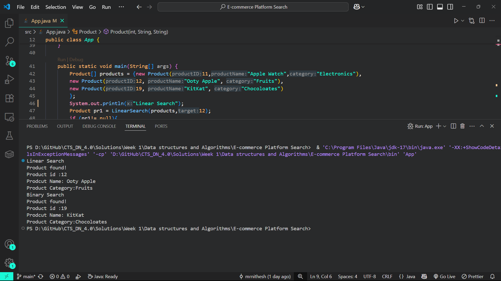

# E-commerce Platform Search Implementation

This project implements and compares search algorithms for an e-commerce platform to optimize search functionality.

## Features

- Product class with attributes:

  - productID
  - productName
  - category
- Search Implementations:

  - Linear Search (O(n)) - Completed
  - Binary Search (O(log n)) - Completed

## Output
 

### Understand Asymptotic Notation:

- *Big O Notation*: Big O notation is a mathematical representation used to describe the upper bound of an algorithm's running time or space requirements in terms of input size (n). It helps in analyzing and comparing the efficiency of algorithms by focusing on their growth rates as the input size increases, abstracting away constant factors and lower-order terms.
- *Best, Average, and Worst-Case Scenarios for Search Operations:*
  - *Best Case:* The scenario where the algorithm performs the minimum possible number of operations (e.g., finding the target element at the first position).
  - *Average Case:* The expected number of operations performed, averaged over all possible inputs or positions of the target element.
  - *Worst Case:* The scenario where the algorithm performs the maximum possible number of operations (e.g., the target element is at the last position or not present at all).

## Time Complexity Analysis

### Linear Search

- Best Case: O(1) - Target found at first position
- Average Case: O(n) - Target found in middle
- Worst Case: O(n) - Target at end or not found

### Binary Search

- Best Case: O(1) - Target found at middle
- Average Case: O(log n) - Target found in middle
- Worst Case: O(log n) - Target not found or at ends

## Test Cases

The program includes sample products across different categories:

- Electronics (Apple Watch)
- Fruits (Ooty Apple)
- Chocolates (KitKat)

## WHich Search Algorithm is More Suitable for E-commerce Platform?

For the e-commerce platform, **binary search** is generally more suitable when searching for products, provided the product list is sorted by the search key (e.g., productID or productName). Binary search offers significantly better performance (O(log n)) compared to linear search (O(n)), especially as the number of products grows. This efficiency is crucial for delivering fast search results and a better user experience.

However, if the product list is unsorted or if searches are performed on attributes that are not sorted, linear search may be necessary. In practice, maintaining sorted data or using advanced data structures (like search trees or hash maps) is recommended to leverage faster search algorithms like binary search.
