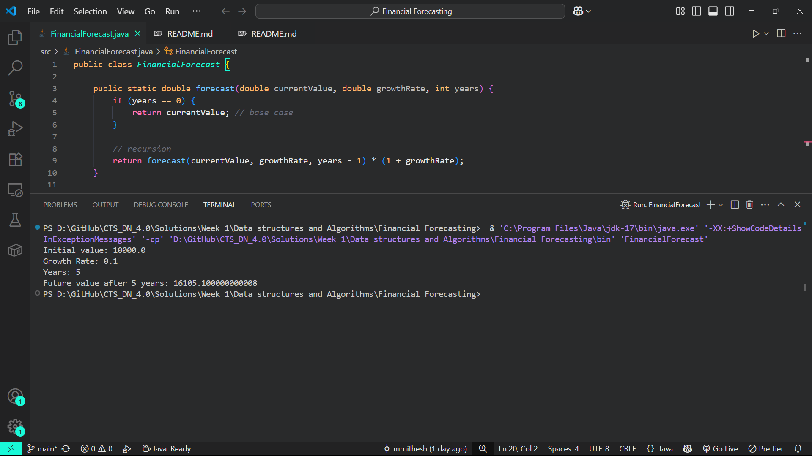

# Financial Forecasting using Recursion

This Java project demonstrates the use of a **recursive algorithm** to predict future investment values based on initial investment and growth rates.

## Problem Statement

Given a current investment amount and a fixed annual growth rate, forecast the value of the investment after a certain number of years using recursion.

### Formula:
```
Future Value = currentValue * (1 + growthRate)^years
```

## Output


## Understanding Recursion

Recursion is a programming concept where a function calls itself to solve a problem by breaking it down into smaller, similar sub-problems. In this project, we use recursion to calculate compound growth over multiple years by:
1. Starting with the base case (year 0)
2. For each subsequent year, applying the growth rate to the previous year's value

## Implementation Details

The recursive solution follows these steps:
1. Base Case: If years = 0, return the current value
2. Recursive Case: Calculate next year's value based on the current value and growth rate
3. Continue recursion until reaching the target year


## Time Complexity Analysis

- **Time Complexity**: O(n), where n is the number of years
  - Each recursive call reduces years by 1 until it reaches 0
  - The algorithm makes exactly n recursive calls

### Optimization Considerations

While recursion provides a clear and elegant solution for financial forecasting, it can lead to redundant calculations and increased stack usage for large input values. Here are some ways to optimize the recursive approach:

1. **Memoization**: Store previously computed results for specific years in a cache (e.g., a `Map<Integer, Double>`). This avoids recalculating the same values multiple times, reducing the number of recursive calls.

2. **Iterative Approach**: For very large numbers of years, consider converting the recursive solution to an iterative one. This eliminates the risk of stack overflow and can be more efficient in terms of memory usage.

3. **Tail Recursion**: If using recursion, structure the function to be tail-recursive (where the recursive call is the last operation). Some Java compilers can optimize tail-recursive calls, though Java does not guarantee tail call optimization.

4. **Mathematical Formula**: Since the future value calculation follows a known mathematical formula, using direct computation with `Math.pow()` is the most efficient and avoids recursion altogether.

By applying these optimizations, we can ensure your financial forecasting tool remains efficient and scalable, even for long-term predictions.

