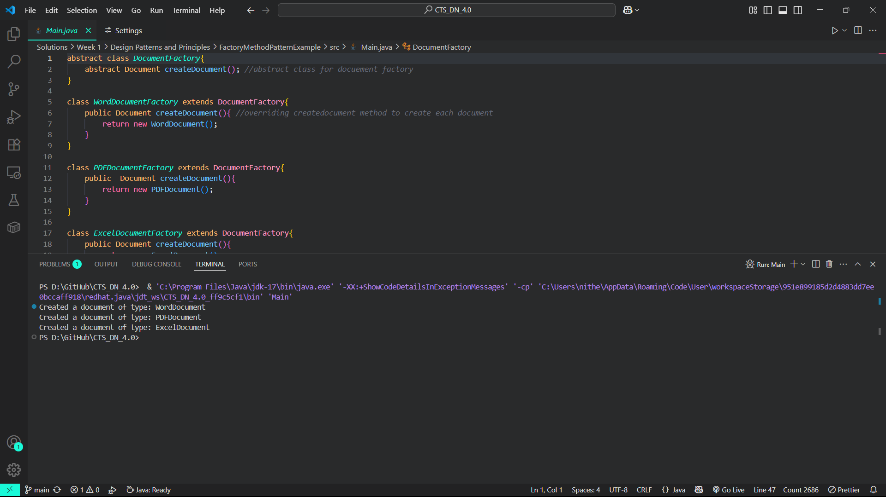

# Factory Method Pattern Example

A simple Java project demonstrating the Factory Method design pattern using Document creation.

## Overview

The Factory Method pattern defines an interface for creating objects but lets subclasses decide which class to instantiate. This is particularly useful for:

- Delegating object creation to subclasses
- Decoupling object creation from its usage
- Making code more flexible and extensible

## Implementation

The project uses:

- `Document` interface as the product
- Concrete documents (`PDFDocument`, `WordDocument`, `ExcelDocument`)
- `DocumentFactory` interface for creating documents
- Concrete factories for each document type

## Output

Below is a sample output of the application:

