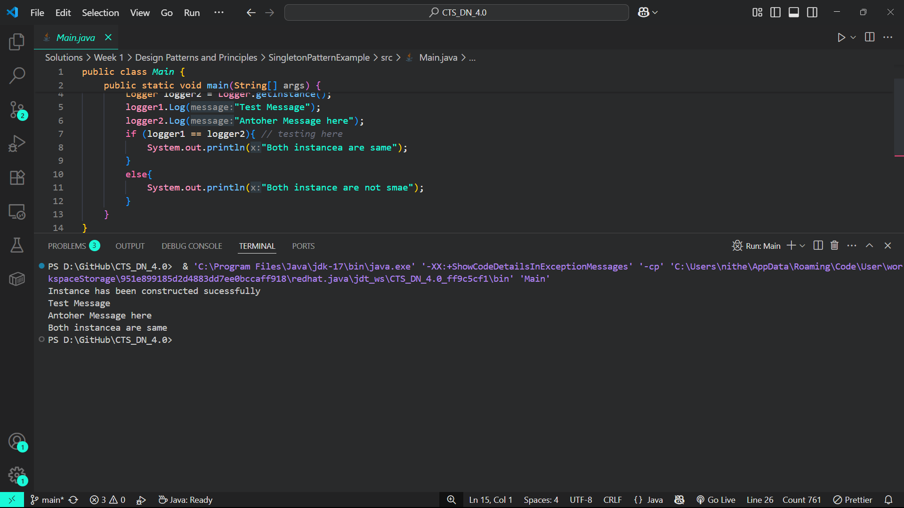

# Singleton Pattern Example

A simple Java project demonstrating the Singleton design pattern using a Logger class.

## Overview

The Singleton pattern ensures that a class has only one instance and provides a global point of access to it. This is particularly useful for:
- Managing shared resources
- Ensuring coordination across the system
- Controlling access to a single instance

## Implementation

The project contains a `Logger` class that implements the Singleton pattern, ensuring only one logger instance exists throughout the application's lifecycle.

## Output

