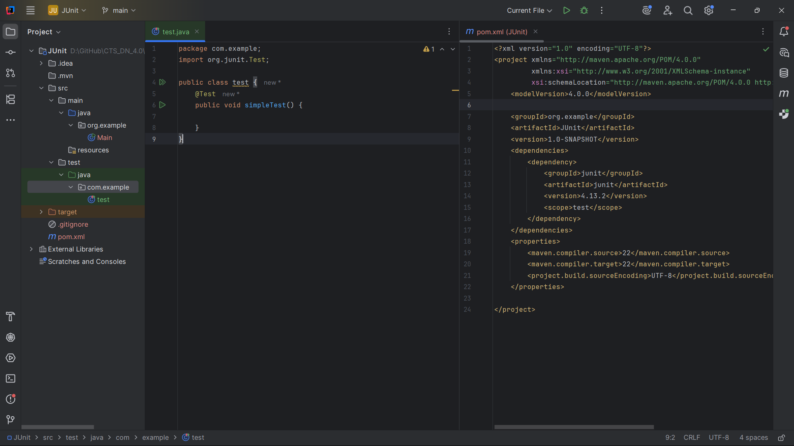
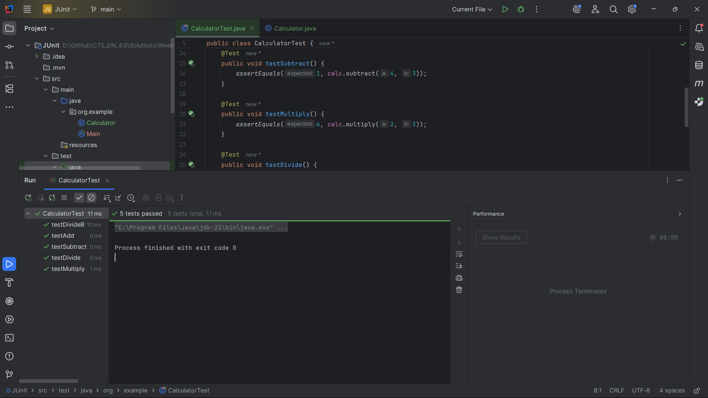
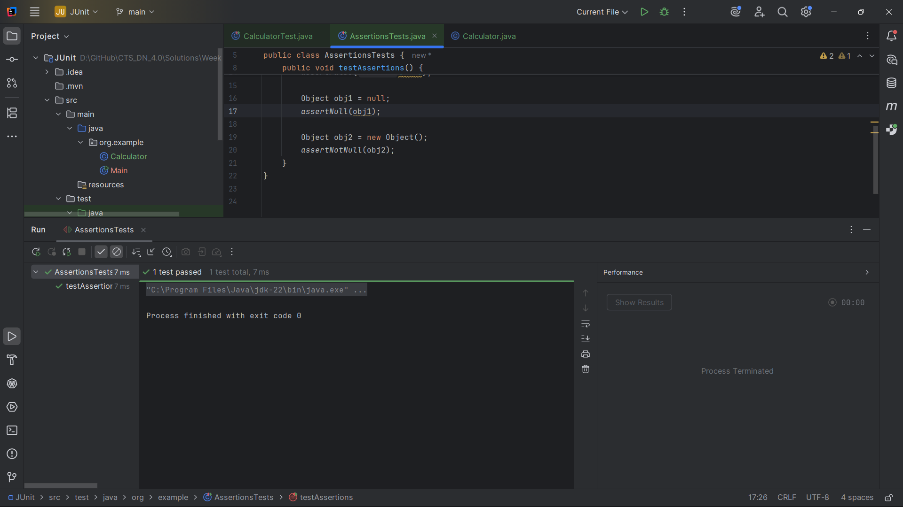
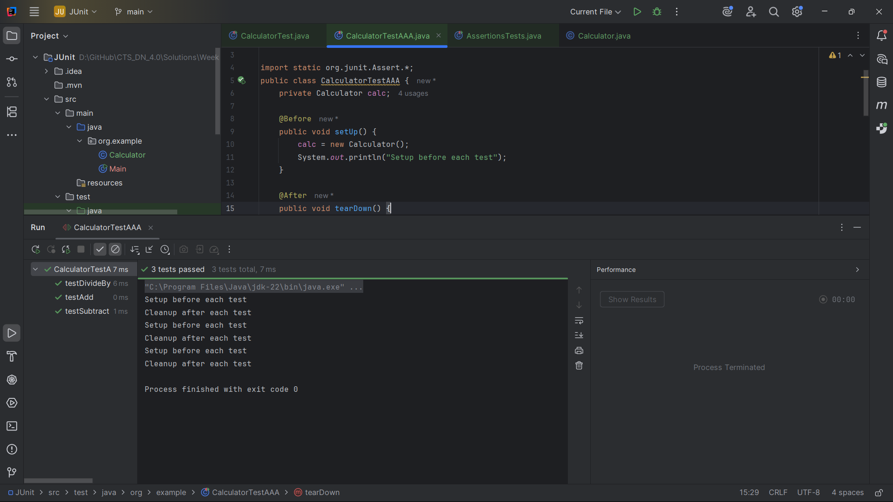

# JUnit Testing Exercises

This project demonstrates the implementation of JUnit testing concepts through a series of progressive exercises. Each exercise builds upon the previous one to provide a comprehensive understanding of JUnit testing framework.

### Exercise 1: Setting Up JUnit
**Objective**: Set up a Maven project with JUnit dependencies and create a basic project structure.

**Files Created**:
- `pom.xml` - Maven configuration with JUnit dependencies
- `src/main/java/org/example/Calculator.java` - Calculator class to be tested

**Output**: 

---

### Exercise 2: Writing Basic JUnit Tests
**Objective**: Write fundamental test methods using JUnit annotations and basic test structure.

**Files Created**:
- `src/test/java/org/example/CalculatorTest.java` - Basic test class with fundamental test methods

**Output**: 

---

### Exercise 3: Assertions in JUnit
**Objective**: Explore different types of assertions available in JUnit for comprehensive testing.

**Files Created**:
- `src/test/java/org/example/AssertionsTests.java` - Comprehensive assertions demonstration

**Output**: 

---

### Exercise 4: Arrange-Act-Assert (AAA) Pattern, Test Fixtures, Setup and Teardown Methods
**Objective**: Implement proper test structure using AAA pattern and lifecycle methods.

**Files Created**:
- `src/test/java/org/example/CalculatorTestAAA.java` - AAA pattern implementation with lifecycle methods

**Output**: 
