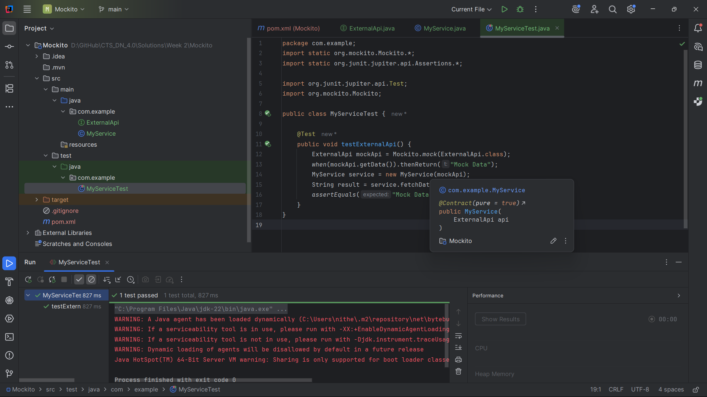
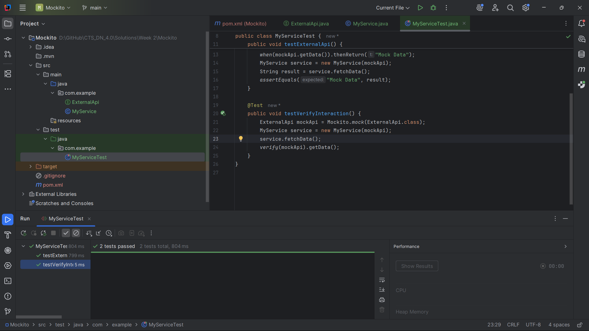

# Mockito Testing Exercises

This project demonstrates the implementation of Mockito testing concepts.

### Exercise 1: Mocking and Stubbing
**Objective**: Learn how to create mock objects and define their behavior using stubbing techniques.

**Output**: 

---

### Exercise 2: Verifying Interactions
**Objective**: Verify that methods are called on mock objects with correct parameters and frequency.

**Output**: 
