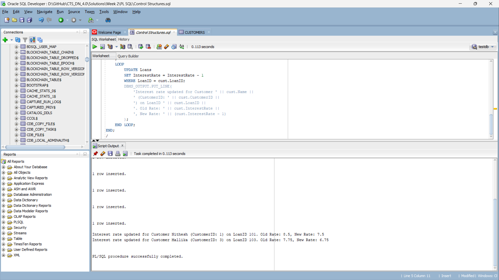
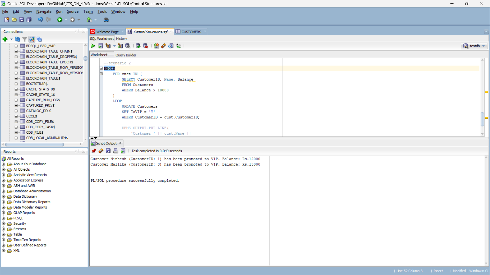
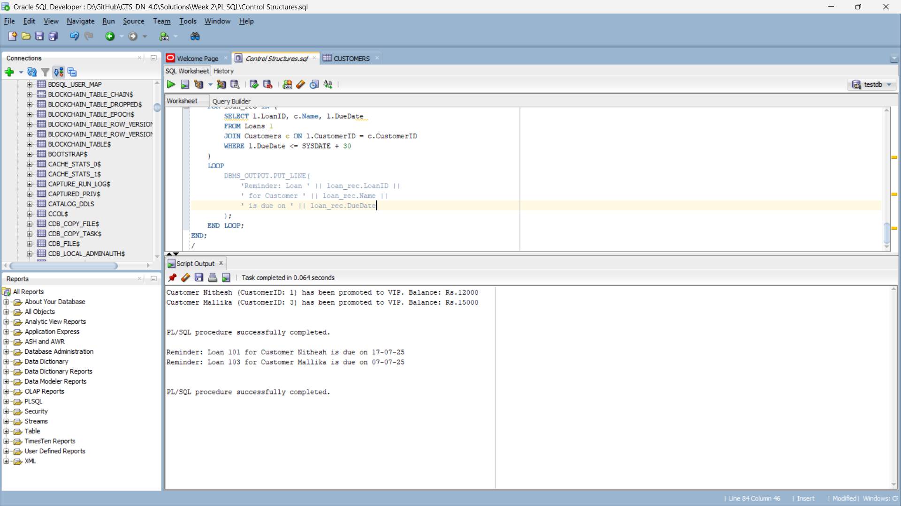

## Overview

The exercise involves three scenarios that demonstrate the use of PL/SQL control structures in a banking system with customers and loans data.

## Scenarios

### Scenario 1: Senior Citizen Loan Discount
**Objective**: Apply a 1% discount to loan interest rates for customers above 60 years old.

**Output**: 

---

### Scenario 2: VIP Customer Promotion
**Objective**: Promote customers to VIP status based on their balance (> $10,000).

**Output**:

---

### Scenario 3: Loan Due Date Reminders
**Objective**: Send reminders to customers whose loans are due within the next 30 days.

**Output**:
