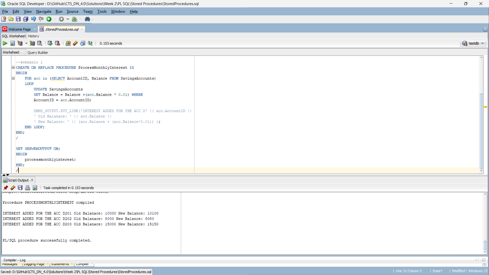
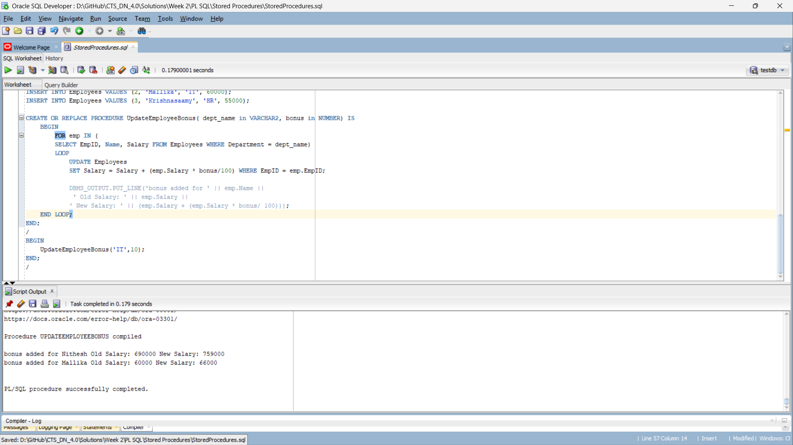
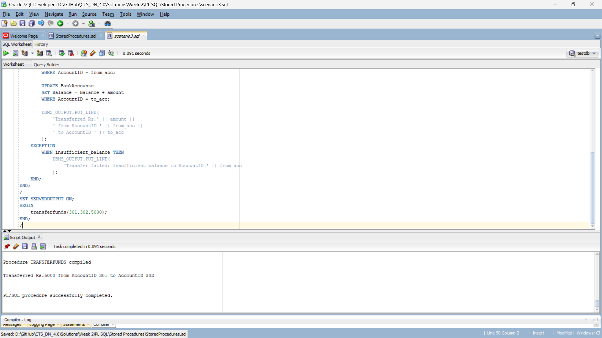

## Overview

The exercise involves three scenarios that demonstrate the use of PL/SQL control structures in a banking system with customers and loans data.

## Scenarios

### Scenario 1: Monthly Interest Addition
**Objective**: Add monthly interest to savings accounts based on their balance.

**Output**: 

---

### Scenario 2: Employee Bonus Update
**Objective**: Update employee salaries by adding a bonus based on their department.

**Output**:

---

### Scenario 3: Fund Transfer
**Objective**: Transfer funds between bank accounts while handling insufficient balance exceptions.

**Output**:
