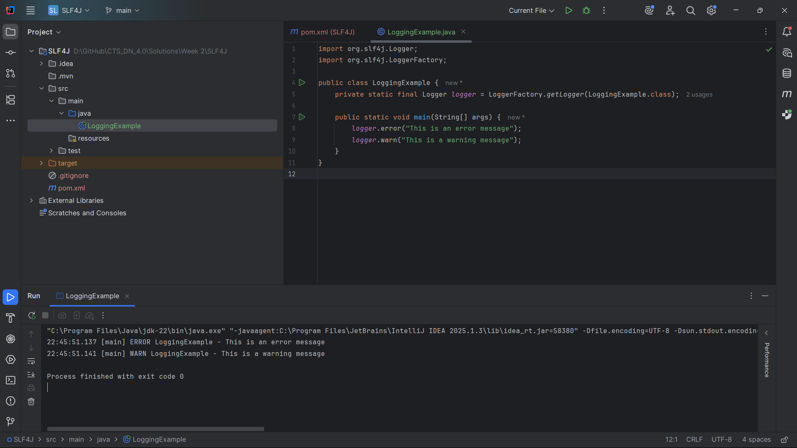

# SLF4J Logging Exercise

### Exercise 1: Simple Logging Class
**Objective**: Create a basic logging implementation using SLF4J framework with different log levels.

**Files Created**:
- `pom.xml` - Maven configuration with SLF4J dependencies
- `src/main/java/LoggingExample.java` - Simple logging class demonstrating various log levels

**Output**: 
