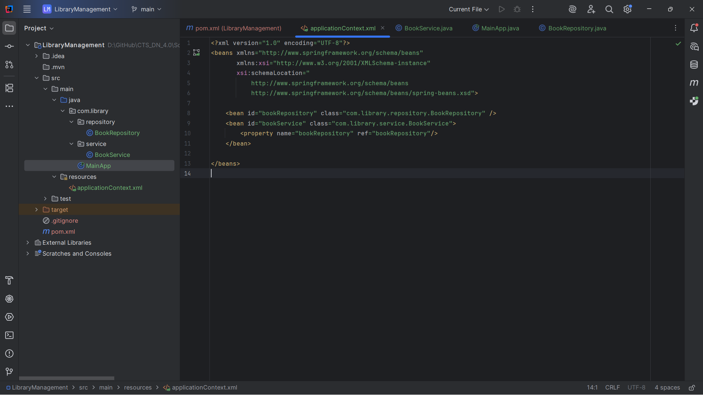
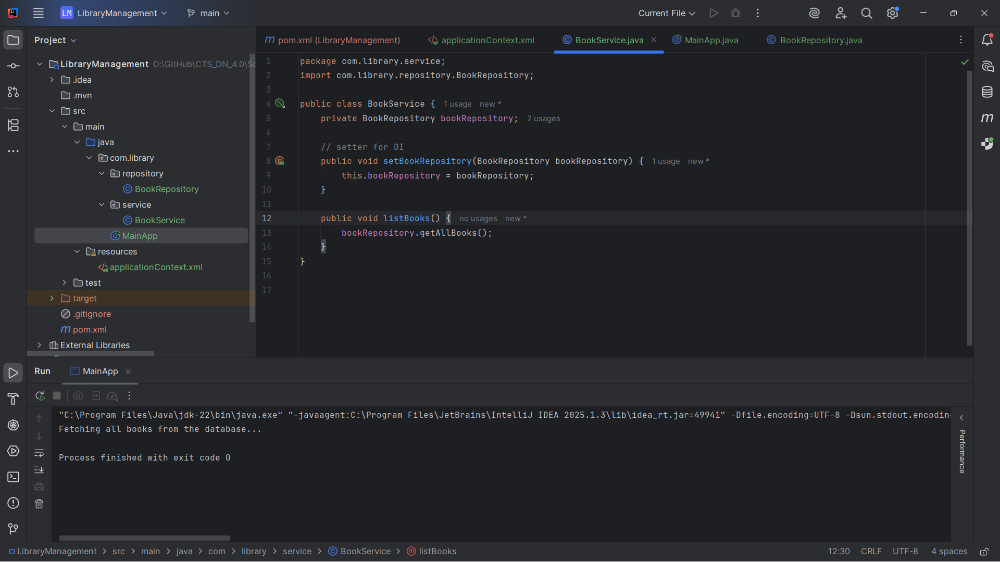
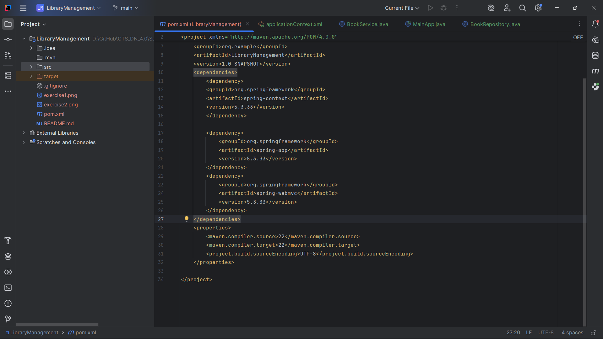

# Spring Framework Exercises

## Exercise 1: Configuring a Basic Spring Application
**Objective**: Set up a Spring project with basic configuration and bean definitions for a library management application.

**Output**: 

---

## Exercise 2: Implementing Dependency Injection
**Objective**: Implement dependency injection using Spring's IoC container to manage dependencies between BookService and BookRepository classes.

**Output**: 

---

## Exercise 4: Creating and Configuring a Maven Project
**Objective**: Set up a comprehensive Maven project structure with proper Spring dependencies and configuration.

**Output**: 
