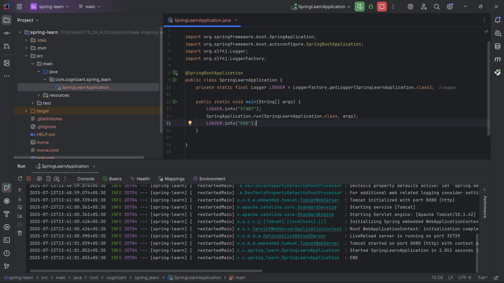
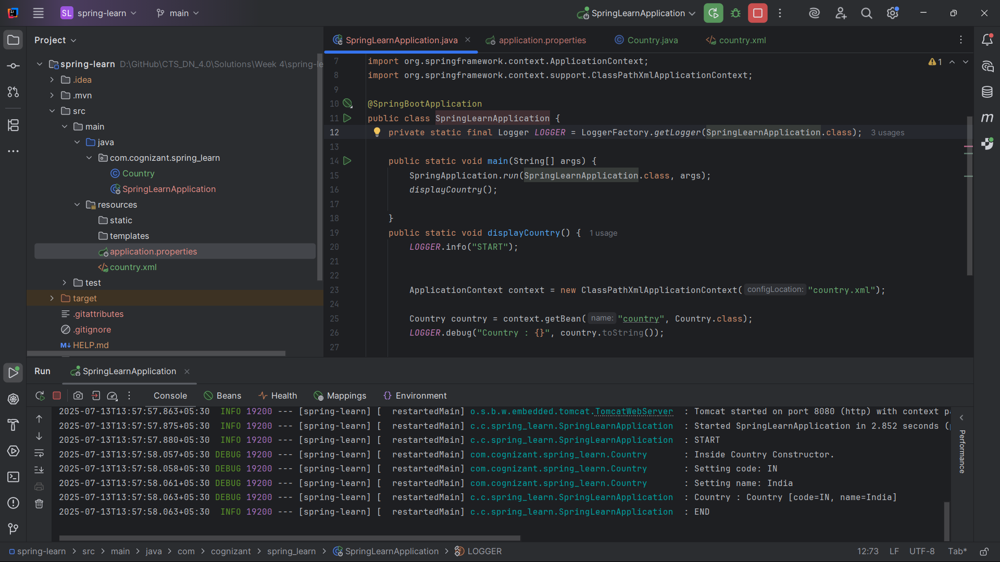
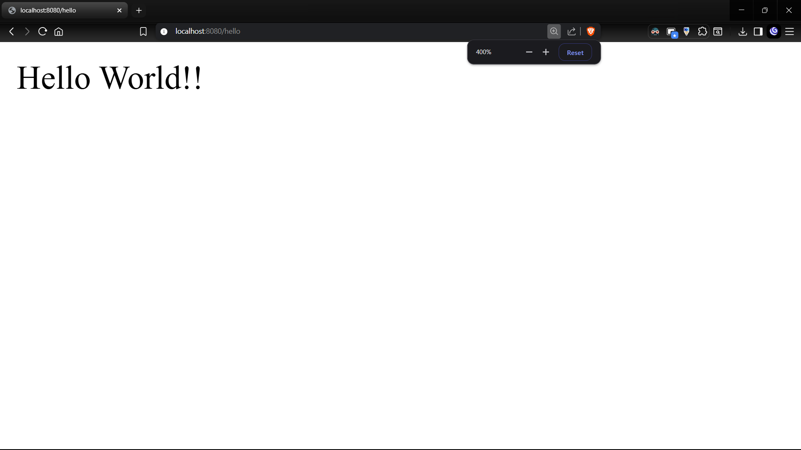
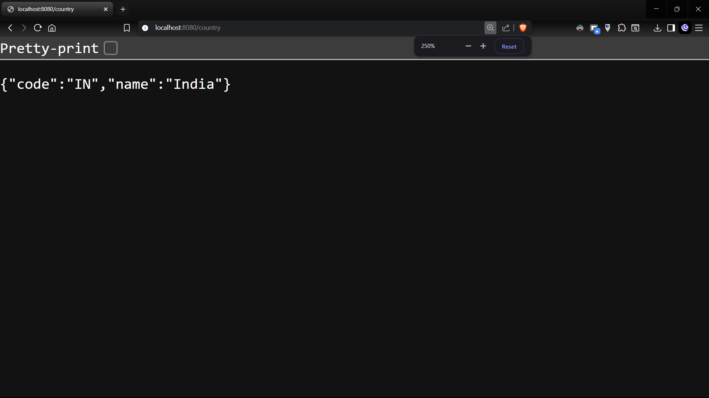
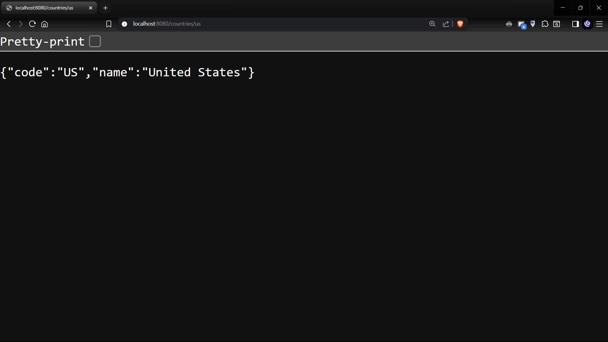
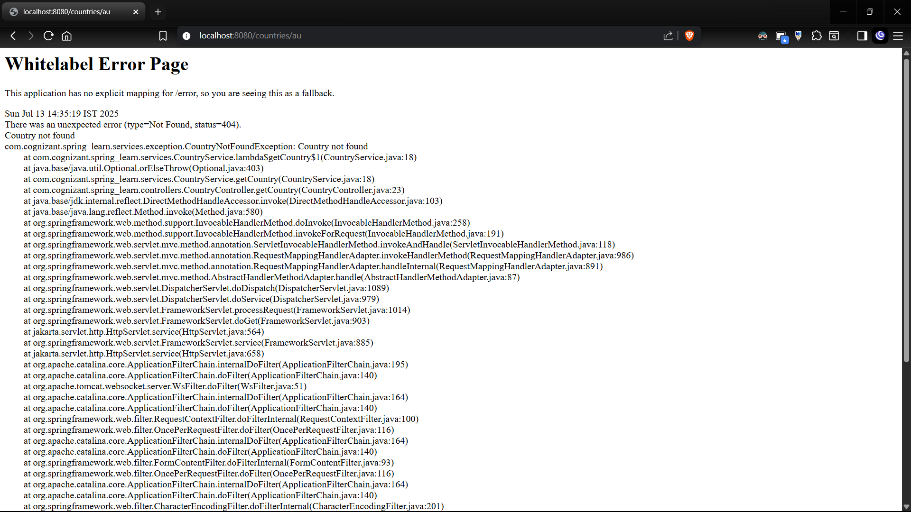

# Spring Framework Exercises

## Exercise 1: Create a Spring Web Project using Maven 
**Objective**: Set up a Spring project with basic configuration 

**Output**: 

---

## Exercise 4: Spring Core – Load Country from Spring Configuration XML 
**Objective**: Implement a Spring application that loads a `Country` object from an XML configuration file.

**Output**: 
--- 

# Spring Rest Exercises

## Exercise 1: Hello World RESTful Web Service 
**Objective**: Create a simple RESTful web service that returns "Hello World".

**Output**: 
---

## Exercise 2: Spring REST – Create a REST - Country Web Service 
**Objective**: Develop a REST service that returns India country details in the earlier created spring learn application..

**Output**: 
---

## Exercise 4: Spring REST – Create a REST - Get country based on country code 
**Objective**: Implement a REST service that retrieves country details based on the country code.

**Output**: 
---
## Exercise 5: Spring REST – Create a REST - Get country exceptional scenario 
**Objective**: Handle exceptional scenarios in the REST service when retrieving country details.

**Output**: 
---