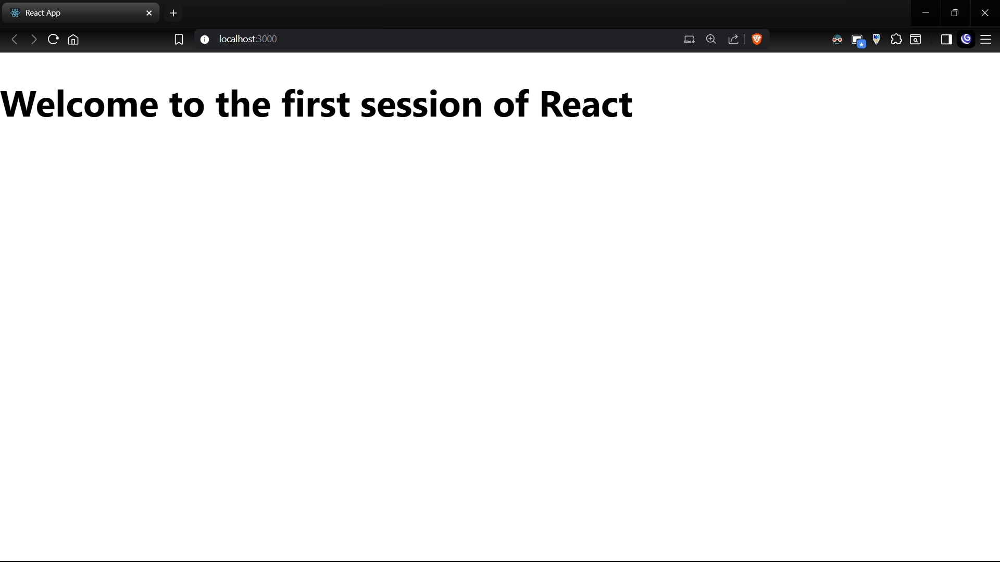
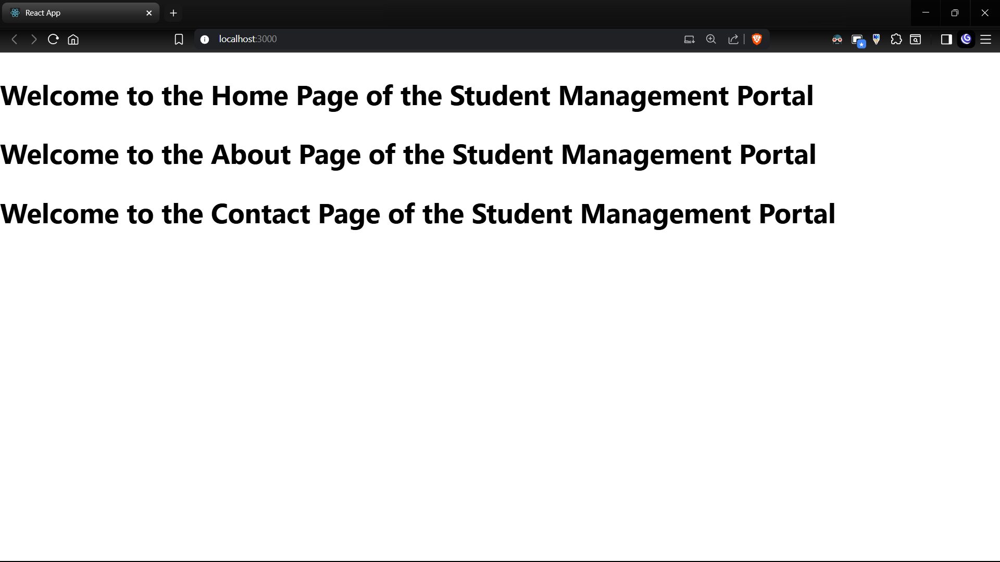
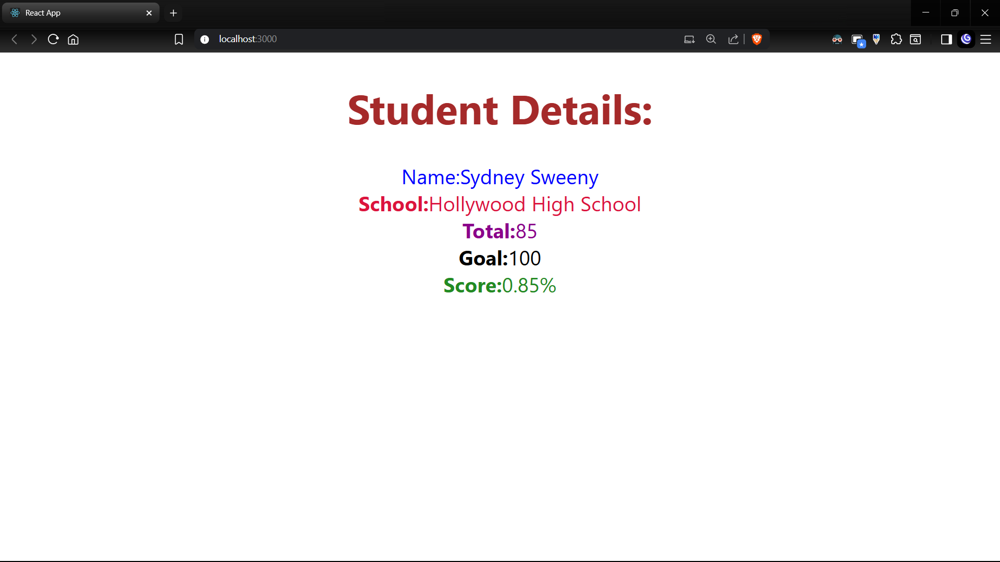
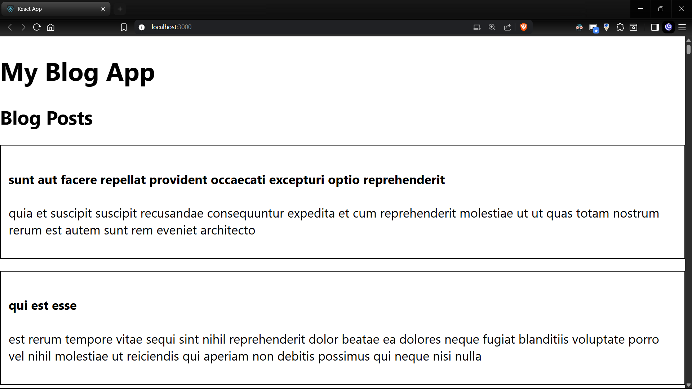
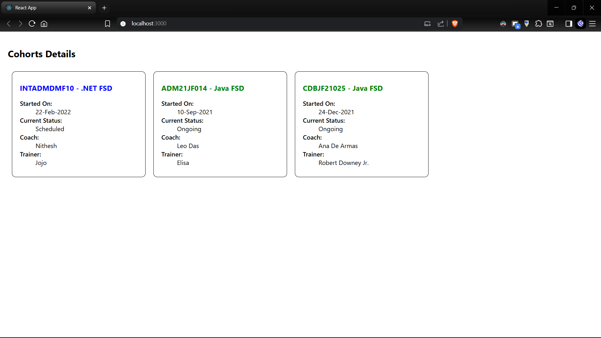

# React Hands-On Lab Exercises

## HOL 1: Introduction to React and Single Page Applications

### Objectives
- Define SPA and its benefits
- Define React and identify its working
- Identify the differences between SPA and MPA
- Explain Pros & Cons of Single-Page Application
- Explain about React
- Define virtual DOM
- Explain Features of React

### Project
- Directory: `myfirstreact`
- A basic React application demonstrating the core concepts of React and SPAs

## HOL 2: React Components

### Objectives
- Explain React components
- Identify the differences between components and JavaScript functions
- Identify the types of components
- Explain class component
- Explain function component
- Define component constructor
- Define render() function

### Project
- Directory: `studentapp`
- A React application demonstrating different component types and structures

## HOL 3: Advanced Component Concepts

### Objectives
- Explain React components
- Identify the differences between components and JavaScript functions
- Identify the types of components
- Explain class component
- Explain function component
- Define component constructor
- Define render() function

### Project
- Directory: `scorecalculatorapp`
- A React application demonstrating score calculation functionality using different component types

## HOL 4: Component Lifecycle Methods

### Objectives
- Explain the need and Benefits of component life cycle
- Identify various life cycle hook methods
- List the sequence of steps in rendering a component

### In this hands-on lab, you will learn how to:
- Implement componentDidMount() hook
- Implementing componentDidCatch() life cycle hook

### Project
- Directory: `blogapp`
- A blog application demonstrating React component lifecycle methods

## HOL 5: Styling React Components

### Objectives
- Understanding the need for styling react component
- Working with CSS Module and inline styles

### In this hands-on lab, you will learn how to:
- Style a react component
- Define styles using the CSS Module
- Apply styles to components using className and style properties

### Project
- Directory: `cohort-dashboard`
- A cohort dashboard application demonstrating various styling techniques in React

