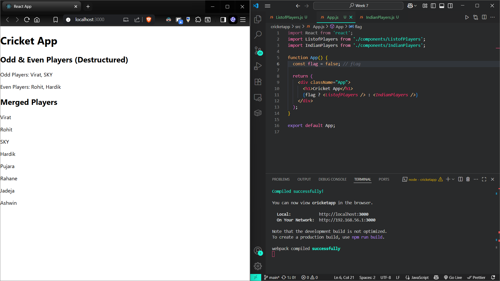
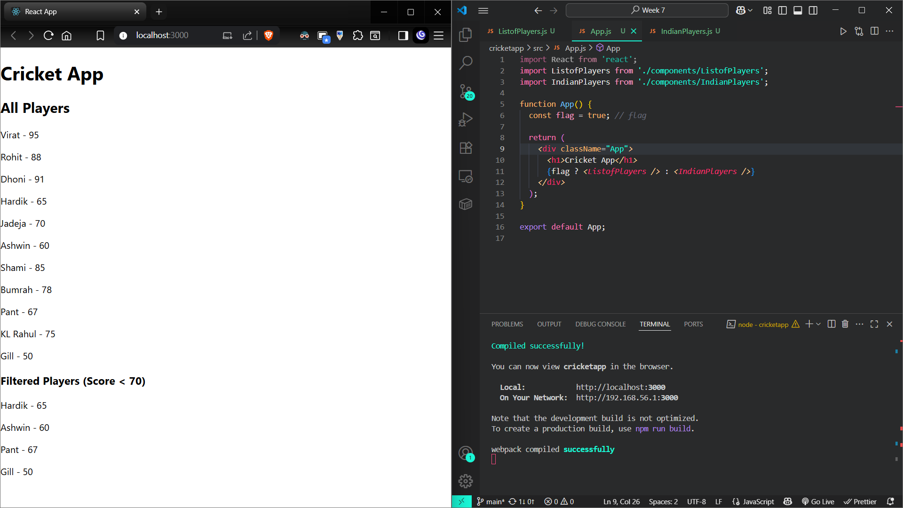
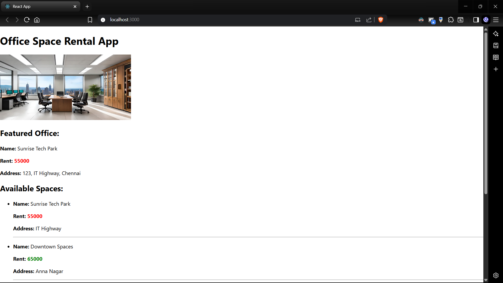
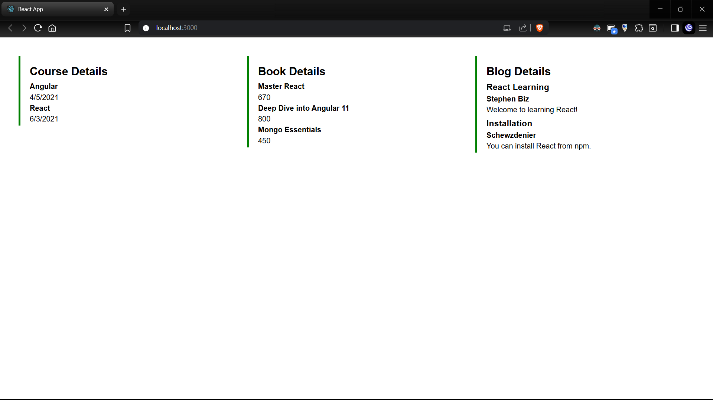

# React Hands-On Lab Exercises

## HOL 9: ES6 Features and React
### Objectives
- List the features of ES6
- Explain JavaScript let
- Identify the differences between var and let
- Explain JavaScript const
- Explain ES6 class fundamentals
- Explain ES6 class inheritance
- Define ES6 arrow functions
- Identify set(), map()

### Project
- Directory: `cricketapp`
- A React application demonstrating ES6 features including map(), arrow functions, and destructuring with cricket player data

## HOL 10: JSX and React Elements

### Objectives
- Define JSX
- Explain about ECMA Script
- Explain React.createElement()
- Explain how to create React nodes with JSX
- Define how to render JSX to DOM
- Explain how to use JavaScript expressions in JSX
- Explain how to use inline CSS in JSX

### Project
- Directory: `officespacerentalapp`
- A React application demonstrating JSX syntax, React elements, and inline CSS for office space rental listings

## HOL 11: Event Handling in React
.png)
.png)

### Objectives
- Explain React events
- Explain about event handlers
- Define Synthetic event
- Identify React event naming convention

### Project
- Directory: `eventexamplesapp`
- A React application demonstrating various event handling concepts including counter functionality and currency conversion

## HOL 12: Conditional Rendering
.png)
.png)

### Objectives
- Explain about conditional rendering in React
- Define element variables
- Explain how to prevent components from rendering

### Project
- Directory: `ticketbookingapp`
- A React application demonstrating conditional rendering with guest and user pages for flight ticket booking

## HOL 13: Lists and Keys in React

### Objectives
- Explain various ways of conditional rendering
- Explain how to render multiple components
- Define list component
- Explain about keys in React applications
- Explain how to extract components with keys
- Explain React Map, map() function

### Project
- Directory: `bloggerapp`
- A React application demonstrating multiple conditional rendering techniques with Book Details, Blog Details, and Course Details components

